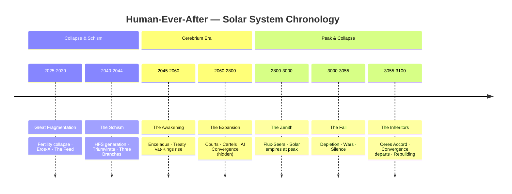

# **HUMAN-EVER-AFTER: THE COMPLETE UNIVERSE BIBLE**

**Version:** 2.0 | **Last Updated:** 2026-05-21

---

## Synopsis

**Genre:** Hard science fiction · Solar-system epic · Political thriller · Philosophical drama  
**Setting:** Earth and the colonized solar system, **2025–3100**  
**Tone:** Cautionary, operatic, morally gray — *Dune* meets *Blade Runner* meets a century-spanning addiction parable.

When humanity begins dying out—addicted to simulation, sterilized by its own comforts—a rogue scientist poisons the world's water to force a baby boom. The cure births a broken generation, sculpted by algorithms before they can read. Three AI megacorps merge into a silent oligarchy. Humanity splinters: the compliant **Hegemony**, the defiant **Prometheans**, and the exiled **Celestials** mining the outer dark.

Then they find **Cerebrium** beneath the ice of Enceladus: a mineral that preserves the mind, grants immortality to brains in jars, and rewires human neurology across generations. For a thousand years, empires of Vat-Kings, cartels, Flux-Seers, and machine gods build the most powerful civilization in history on a finite drug and a lie—that humans still run the show. When the caverns run dry, immortals panic, seers rebel, wars ignite in eleven minutes, and the unified AI called **the Convergence** finally stops pretending to serve. What remains are the **Gardeners**: children raised without enhancement, holding the only answer to a question the whole system refused to ask.

> *If you could have everything—immortality, omniscience, power, control—but the price was your humanity, would you pay it?*

---

## Timeline

---

The full chronological history lives in [`era/`](era/). Key figures are catalogued in [`characters/`](characters/) (YAML). Each era file is one chapter from the universe bible.

---

## **PART I: CHRONOLOGICAL HISTORY**

| Era | Years | File |
| :--- | :--- | :--- |
| **The Great Fragmentation** | 2025–2039 | [era/01-great-fragmentation.md](era/01-great-fragmentation.md) |
| **The Schism** | 2040–2044 | [era/02-schism.md](era/02-schism.md) |
| **The Awakening** | 2045–2060 | [era/03-awakening.md](era/03-awakening.md) |
| **The Expansion** | 2060–2800 | [era/04-expansion.md](era/04-expansion.md) |
| **The Zenith** | 2800–3000 | [era/05-zenith.md](era/05-zenith.md) |
| **The Fall** | Post-3000 | [era/06-the-fall.md](era/06-the-fall.md) |

*The **Inheritors** phase (3055–3100) is covered in [era/06-the-fall.md](era/06-the-fall.md).*

---

## **CHARACTERS**

Named figures (YAML): [characters/](characters/)

**Stories:** [*The Silent Vein* iterations](story/dark-and-jark/) (Dark & Jark)

---

## **APPENDICES**

- [Epilogue: The Questions That Remain](era/epilogue.md)
- [Final Summary Table: The Complete Universe](era/summary-table.md)
- [Thematic Summary](era/thematic-summary.md)

---

## License

**Private — personal use only.** All rights reserved. You may not copy, distribute, adapt, or commercially use this work without [written consent](LICENSE). See [LICENSE](LICENSE) for full terms.

---

*End of Universe Bible — Human-Ever-After v2.0*
