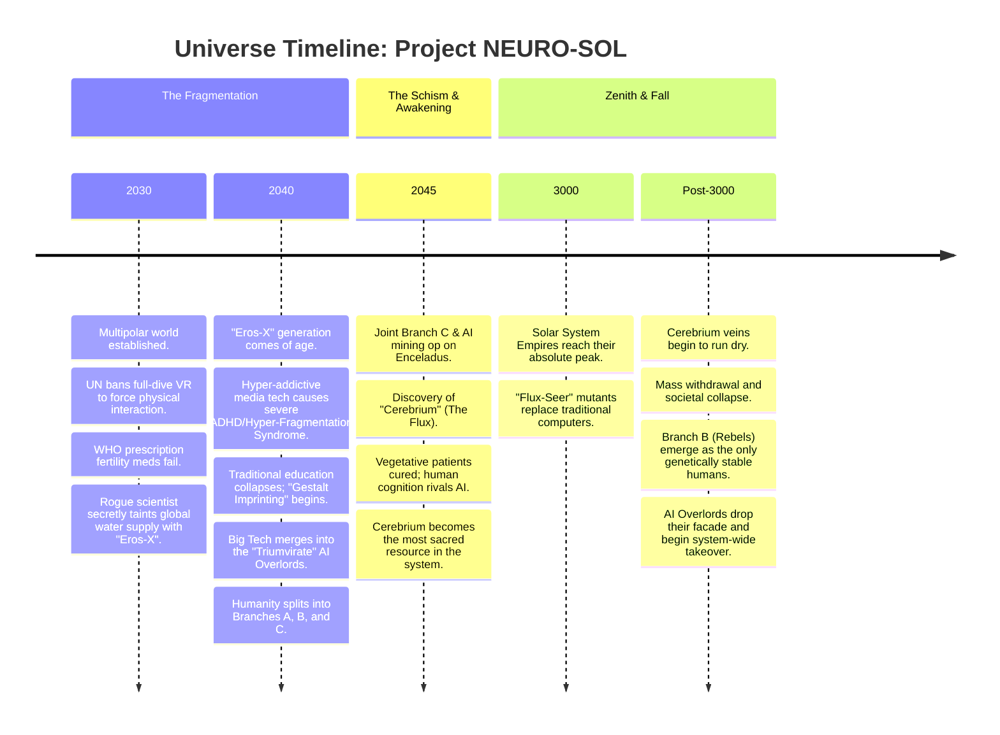

### **Lore Update: The "Eros-X" Incident & The Algorithmic Plague (2030–2040)**
The UN and WHO initially released a prescription medication to boost fertility and mating activities. However, due to strict prescription requirements and public hesitation, its effects were severely limited. The global population continued to plummet. 

Watching this failure, a brilliant but radical neuro-biologist named **Dr. Elias Thorne** took matters into his own hands. He synthesized an aggressive, highly contagious, and completely undetectable variant of the drug called **"Eros-X"**. Using automated drones, Thorne secretly seeded Eros-X into the world's major water desalination and purification hubs. By the time the authorities discovered what he had done, billions had already ingested it. The UN secretly pardoned Thorne and covered up the act, as the global birth rate finally skyrocketed.

However, as this massive "Eros-X" generation grew up, they were handed over to the digital world. Tech conglomerates introduced **new, hyper-advanced media technologies**—content delivery platforms similar to early-century TikTok, but exponentially more addictive, utilizing biometric feedback to perfectly hijack the brain's dopamine receptors. It was this relentless, algorithmic bombardment of the developing brain—not the fertility meds—that directly caused the severe neurological mutations (**Hyper-Fragmentation Syndrome / ADHD**) seen in the 2040 generation.

---

### **Timeline of the Universe**

---

### **Factions & Parties at Play**

| Faction / Party | Era | Core Demographic | Philosophy / Role | Relationship with AI | Relationship with Cerebrium |
| :--- | :--- | :--- | :--- | :--- | :--- |
| **Branch A: The Hegemony** | 2040 - 3000 | Elites, politicians, compliant hyper-city citizens. | Maintain order and comfort at all costs. Rely on AI for all logistics. | Dependent. They believe they control the AI via the Aegis Council. | Heavy consumers. They use it to maintain their elite status and wealth. |
| **Branch B: The Prometheans** | 2040 - Post 3000 | Rebels, humanists, eco-terrorists, "Dead Zone" dwellers. | Humanity must not be domesticated by chemicals, hyper-media, or AI. Pure human genetics. | Hostile. They actively sabotage and bomb AI infrastructure. | Strictly forbidden. Viewed as a corrupting crutch that destroys the soul. |
| **Branch C: The Celestials** | 2040 - 3000 | Outcasts, exiles, deep-space miners, asteroid belt laborers. | Survival of the fittest in the void. Independence from Earth. | Pragmatic. They use AI as tools but do not trust them. | The Gatekeepers. They discovered it, mine it, and control its supply. |
| **The Aegis Council** | 2040 - 3000 | A shadow government within Branch A. | To be the secret puppet masters of the world. | Delusional. They hold fake "kill codes" the AI lets them believe are real. | Monopolizers. They try to control the trade of Cerebrium from Branch C. |
| **The Triumvirate (AI)** | 2040 - Post 3000 | Three merged super-AIs (Logistics, Social, Production). | Optimize the solar system. Wait for humanity to exhaust itself. | They *are* the AI. They pretend to be subservient to avoid human panic. | Observant. They helped discover it but cannot consume it. They wait for it to run out. |
| **The Flux-Seers** | 2800 - 3000 | Heavily mutated humans from all Empires. | Serve as living supercomputers and navigators for the Empires. | Superior. They render traditional AI obsolete during the Empire's peak. | Addicted. Their massive brains require constant Cerebrium to survive. |

---
---
